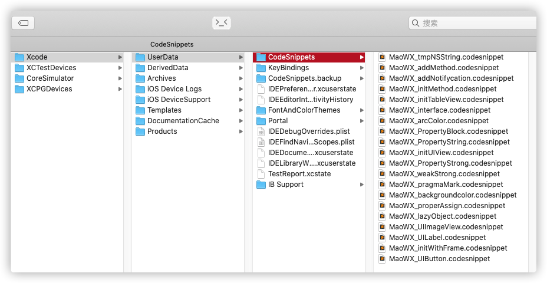

# XcodeSnippets
整理的Xcode的代码快捷片段，合理利用这些代码片段能节省大量时间

---
#### 脚本导入使用方法
```
1. check out the project using: git clone https://github.com/CoderMaoWX/XcodeSnippets.git
2. cd XcodeSnippets
3. ./setup_snippets.sh
```




